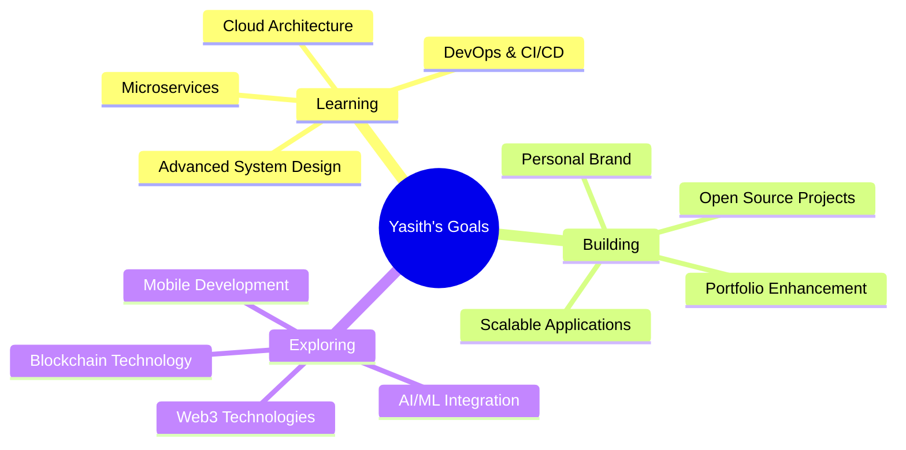

# 🌟 Yasith Rashan

<div align="center">
  
</div>

<div align="center">
  
</div>

## 🧑‍💻 About Me


```typescript
interface Developer {
  name: string;
  role: string;
  education: string;
  location: string;
  languages: string[];
  technologies: string[];
  currentFocus: string[];
  funFact: string;
}

const yasith: Developer = {
  name: "Yasith Rashan",
  role: "Software Engineer & Full Stack Developer",
  education: "Computer Science @ University of Westminster",
  location: "Sri Lanka 🇱🇰",
  languages: ["JavaScript", "TypeScript", "Python", "Java", "PHP"],
  technologies: ["React", "Node.js", "Spring Boot", "MongoDB", "Docker"],
  currentFocus: ["System Design", "Cloud Architecture", "DevOps"],
  funFact: "I turn coffee into code and bugs into features! ☕️"
};
```

## 🔗 Connect With Me

<div align="center">
  <a href="https://linkedin.com/in/yasith-rashan-a44b54295" target="_blank">
    
  </a>
  <a href="https://www.yasithrashan.online/" target="_blank">
    
  </a>
  <a href="mailto:yasith.20222071@iit.ac.lk" target="_blank">
    
  </a>
  <a href="https://instagram.com/yxsiya" target="_blank">
    
  </a>
  <a href="https://github.com/YasithRashan" target="_blank">
    
  </a>
</div>

## 🛠️ Tech Arsenal

<div align="center">

### 🎨 Frontend Magic
<p>
  
  
  
  
  
  
</p>

### ⚙️ Backend Power
<p>
  
  
  
  
  
  
</p>

### 🗄️ Database & Cloud
<p>
  
  
  
  
</p>

### 🔧 DevOps & Tools
<p>
  
  
  
  
  
</p>

</div>

## 📊 GitHub Analytics

<div align="center">
  
  
</div>

<div align="center">
  
</div>

## 🏆 Achievements & Trophies

<div align="center">
  
</div>

## 📈 Contribution Activity

<div align="center">
  
</div>

## 🎯 Current Focus & Goals

<div align="center">



</div>

## 💡 Featured Projects

<div align="center">
  <a href="https://github.com/YasithRashan/project1">
    
  </a>
  <a href="https://github.com/YasithRashan/project2">
    
  </a>
</div>

## 🎵 Coding Playlist

<div align="center">
  
</div>

## 🌟 Fun Facts & Interests

<div align="center">

| 🎯 Current Status | 🚀 Next Goals | 🎨 Interests |
|-------------------|---------------|--------------|
| 🔭 Building scalable web apps | 🌐 Master cloud architecture | 🎮 Gaming |
| 🌱 Learning system design | 📱 Explore mobile development | 📚 Reading tech blogs |
| 👥 Open to collaborations | 🤖 Dive into AI/ML | ☕ Coffee enthusiast |
| 💼 Seeking opportunities | 🌍 Contribute to open source | 🎵 Music lover |

</div>

## 💭 Philosophy

<div align="center">
  
</div>

---

<div align="center">
  
  
  <h3>🚀 "Turning ideas into reality, one commit at a time" 🚀</h3>
  
  <p>⭐ If you like my work, consider giving a star to my repositories! ⭐</p>
</div>

<div align="center">
  
</div>
